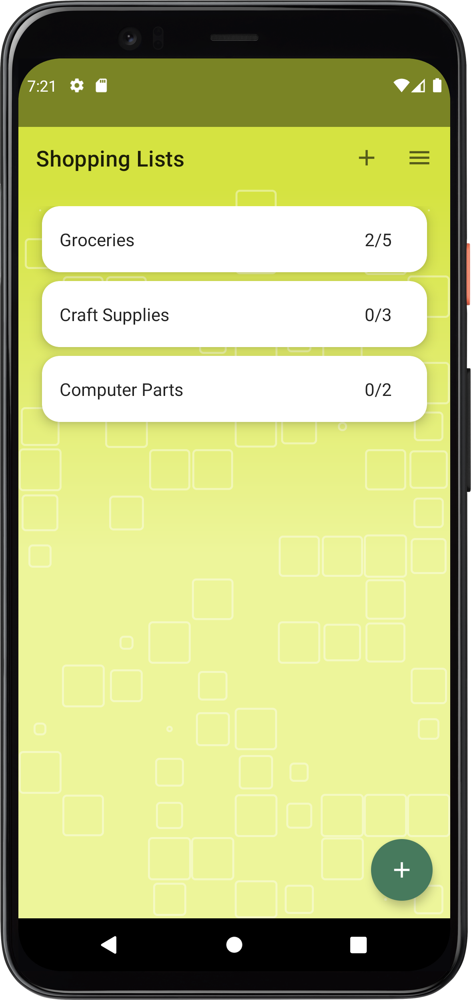
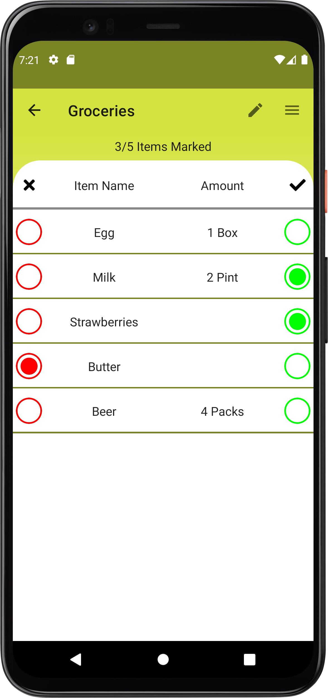
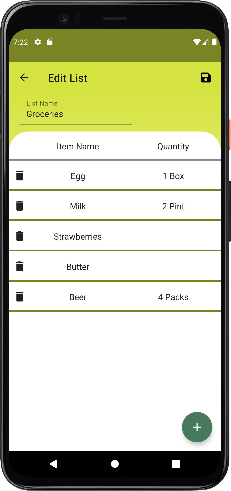
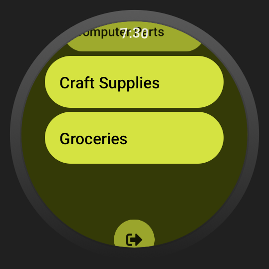
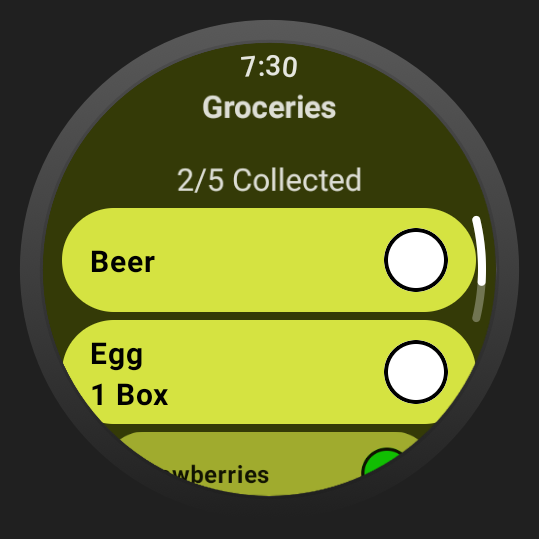

# Shopping List
---

This native Android application allows creating local or remote list of items in order to hep with helps with remembering the items required and keeping impulsive buying behaviour in check.

This application is made using jetpack compose and Firebase authentication and data storage and support both Android mobile phones and WearOS smart watches.

The WearOS smart watch application allows viewing the remote list and marking them when an item is collected or missing.

## Installation
---
 You can download the APK files in the release page of this repository.

 Alternatively you can build from the source code. For remote storage you would require to setup a firebase. You would need to place the google-service.json file in app and wear directories and replace the `web_client_id` string resource in core\src\main\values\strings.xml with the client id of the created firebase project.

## ScreenShots
---
### Mobile Application
<table>
  <tr>
    <td></td>
    <td></td>
    <td></td>
  </tr>
 </table>

 ### Smart Watch Appliction
 <table>
  <tr>
    <td></td>
    <td></td>
  </tr>
 </table>
